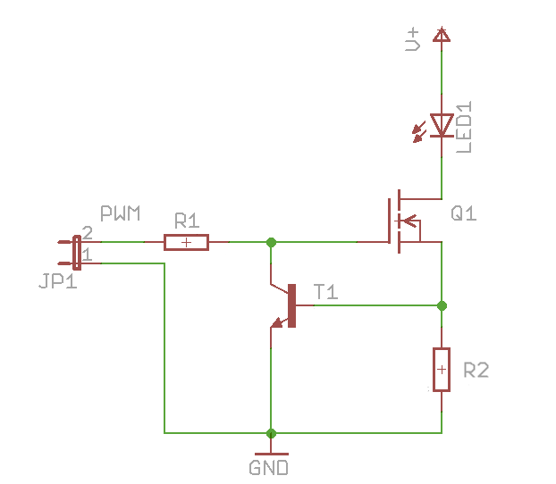

# Lulu-star / Hardware
**Programming light into textile**

###  File Naming conventions / Version Control
- First number is used to specify Lulu type
  - 2.0.0 -> Lulu-star
  - 3.0.0 -> Lulu-daisy
  - 4.0.0 -> Lulu-MCU
- Second number is used to specify the PCB shape
  - 2.0.0 -> Lulu-star/Circle (this is the most common eTextile PCB shape but doesn't fit the zero waste).
  - 2.1.0 -> Lulu-star/Triangle (this shape fit the three wire connectors and zero waste panelization process).
  - 2.2.0 -> Lulu-star/Blob...
- Third number is used to specify the iteration
  - 2.1.1 -> [Made with Upverter an online PCB router software.](https://upverter.com/DataPaulette/08fe1452dfd87b08/Lulu-star_211/ "Made with Upvetrter, online PCB router software") 
  - 2.1.2 -> [Made with KiCad 5.0.0](./kicad_Lulu_star/Lulu_star_212/ "Made with KiCad 5.0.0") 

## Hardware design
This branch is using a 200mA power LED with current current circuitry.
We are looking for a shape that allow zero waste in the PCB panelization process.

Lulu-star have three connections.
- [+] 3.3 to 60 Voltes
- [PWM] I/O PIN
- [-] GND

      _______
     |       |
     | POWER |-----------------
     |_______|--------------| |
        | |                 | |
      + | | -             + | | -
     ___|_|____             | |
    |         |           __| |__
    |    A    |   PWM    |       |
    |    R    |--------->| LULU  |
    |    D    |          |_______|
    |    U    |             | |
    |    N    |           __| |__
    |    I    |   PWM    |       |
    |    O    |--------->| LULU  |
    |_________|          |_______|
                            | |

Easy to programmed, Lulu-star is using the Arduino IDE standard functions.
No library required.

    digitalWrite(LED_PIN, state);
    analogWrite(LED_PIN, val);

### LED driver
##### Constant current source

**References**
- https://learn.adafruit.com/pixie-3-watt-smart-chainable-led-pixels/design
- http://www.instructables.com/id/Power-LED-s---simplest-light-with-constant-current/
- https://scienceprog.com/building-simple-constant-current-power-led-driver/
- http://www.pcbheaven.com/userpages/LED_driving_and_controlling_methods/?topic=worklog&p=3

#### Circuit part list
| Part                         | REF                       | Package                | Price per unit | Weblink                |
| ---------------------------- | ------------------------- | -----------------------|--------------- |------------------------|
| Power LED / OSRAM 200mA      | LY CN5M                   |                        | 0.65 $         | [https://fr.aliexpress.com/LY-CN5M](https://fr.aliexpress.com/item/OSRAM-OSLON-SX-High-Power-LED-0-5W-3030-Yellow-LY-CN5M/32865040281.html?spm=a2g0s.9042311.0.0.27426c371XVtDl) |
| Q1 - large N-channel MOSFET  | IRLML2060TRPBF            | SOT-23                 | 0,126 €        | [https://fr.farnell.com/IRLML2060TRPBF](https://fr.farnell.com/infineon/irlml2060trpbf/mosfet-n-ch-60v-1-2a-sot-23/dp/1791578) |
| T1 - small NPN transistor    | MMBT2222A                 | SOT-23                 | 0,0412 €       | [https://fr.farnell.com/MMBT2222A](https://fr.farnell.com/on-semiconductor/mmbt2222att1g/transistor-bipol-npn-40v-sc-75/dp/2464039) |
| R1                           | Approximately 47k-ohm     | 0603                   | 0,0147 €       | [https://fr.farnell.com/R-47k-ohm ](https://fr.farnell.com/vishay/crcw060347k0fkea/res-couche-epaisse-47k-1-0-1w/dp/1469811) |
| R2 - current set resistor    | 2.7 ohms 1/4 watt         | 1206                   | 0,0246 €       | [https://fr.farnell.com/R-2.7-ohm](https://fr.farnell.com/walsin/wr12w2r70ftl/resist-couche-epaisse-2-7r-1-0/dp/2668305) |

**R2** is used to set the current limit and this doesn't depends on the voltage supply VDD.
**Q1** is used as a variable resistor. **Q1** starts out turned on by **R1**.
**T1** is used as an over-current sensing switch, and **R2** is the "sense resistor" that triggers **T1** when too much current is flowing.
The main current flow is through the LED's, through **Q1**, and through **R2**.
When too much current flows through **R2**, **T1** will start to turn on, which starts turning off **Q1**. Turning off **Q1** reduces the current through the LED's and **R2**.
So we've created a **feedback loop**, which continuously tracks the current and keeps it exactly at the set point at all times.
The NPN transistors **T1** have a specified 0.6V drop between base and emitter when on.
This means the voltage across their respective shunt resistors **R2** will always be 0.6V.
According to Ohm’s law, this means that the current through them will be '0.6 V / 2.7 Ohm', or about 222mA.

### PCB manufacturing characteristics

- **V2.0.0** and **V2.1.0** have been produced in small batch with this characteristics (20 pce)
  - Base Material : FR-4 TG13
  - No. of Layers : 2 layers
  - PCB Thickness : 1.6
  - PCB Color : Black
  - Surface Finish : HASL
  - Minimum Solder Mask Dam : 0.4 mm
  - Copper Weight : 1oz
  - Minimum Drill Hole Size : 0.3 mm
  - Trace Width / Spacing : 5/5 mil
  - Blind or Buried Vias : NO
  - Plated Half-holes / Castellated Holes : YES
  - Impedance Control : NO

#### Extra Part list
| Part                       | REF                      | Price per unit   | Weblink        |
| -------------------------- | ------------------------ | -----------------|--------------- |
| Brass tube                 | 2 mm Hole 5-10 mm Length |                  |                |
| JTE connector              | 1.5 / 8 mm               |                  |                |
| Optical fibres PMMA        | 0.25 mm x 35 pce         |                  |                |
| Optical fibres TPU         | 1.5, 2, 3 mm             |                  |                |
| Optical fibres tube + core |                          |                  | [www.leds-and-more.de](https://www.leds-and-more.de/catalog/15mm-lwl-lichtwellenleiter-lichtleiter-seitlich-leuchtend-p-1937.html?osCsid=2me5dl4q5amcvgb6tnbqfd87i5) |

## TODO
- [ ] Find 0.5W side LEDs
- [ ] Chose between a small single LED driver & Constant current source circuitry
- [ ] Optimize the power LED heat dissipation
- [ ] Identifying distributors in Europe